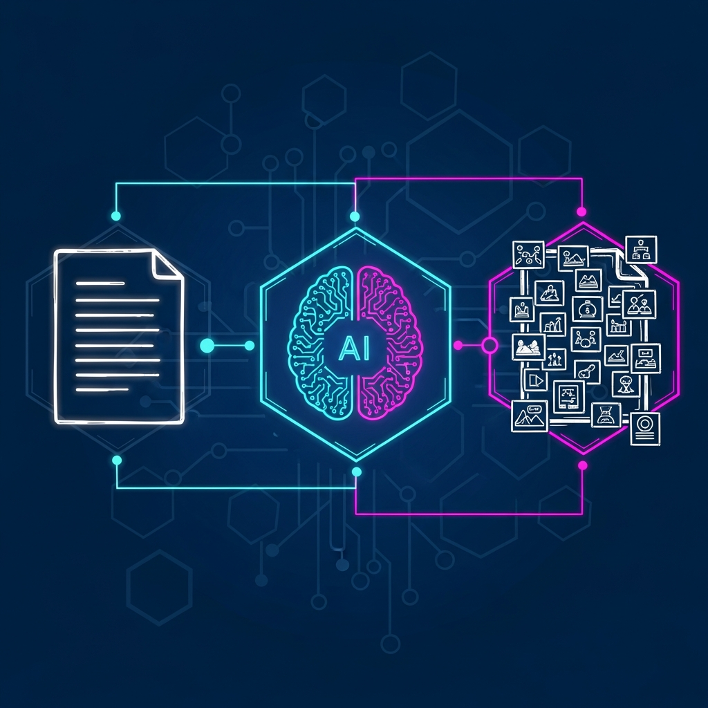

# 📊 文章配图完成报告

## 执行总结

### ✅ 已完成步骤 (100%)

| 步骤 | 状态 | 说明 |
|------|------|------|
| 1. 文章分析 | ✅ 完成 | 分析文章结构，识别6个配图位置 |
| 2. 风格选择 | ✅ 完成 | 自动匹配 **tech** 风格 |
| 3. 配图方案 | ✅ 完成 | 生成详细配图方案 |
| 4. 提示词生成 | ✅ 完成 | 6个详细提示词文件已生成 |
| 5. 图像生成 | ⏸️ API余额不足 | 需使用其他工具生成 |

---

## 配图方案详情

**文章标题**：我写了个 Skill，让 Agent 自动给文章配图

**使用风格**：tech（科技风格）

**配色方案**：
- 主色：深蓝 (#0A1628)
- 辅色：紫罗兰 (#6366F1)
- 点缀：霓虹青 (#00F0FF)、霓虹粉 (#FF006E)

**配图清单**（6张）：

| # | 文件名 | 位置 | 目的 |
|---|--------|------|------|
| 1 | `001-auto-illustration-concept.png` | 开头后 | 展示自动化配图概念 |
| 2 | `002-progressive-loading.png` | 渐进式加载章节 | 可视化渐进式加载机制 |
| 3 | `003-five-step-workflow.png` | 配图设计思路 | 展示五步工作流 |
| 4 | `004-skill-structure.png` | SKILL.md 章节末 | 展示 Skill 文件结构 |
| 5 | `005-prompt-assembly.png` | 提示词设计章节 | 展示提示词组装过程 |
| 6 | `006-end-to-end-flow.png` | 工作流程详解 | 展示端到端完整流程 |

---

## 🎨 完整提示词

### 配图 1：自动化配图概念

**位置**：开头后（"我最近折腾了一个 Agent Skill..."段落之后）

**提示词**：
```
Create a tech-style infographic illustration about Automated Article Illustration.

Image Specifications:
- Type: Infographic illustration
- Orientation: Landscape
- Aspect Ratio: 16:9
- Style: Hand-drawn illustration

Color Palette:
- Primary: Deep blue (#0A1628)
- Secondary: Violet (#6366F1)
- Accents: Neon cyan (#00F0FF), Neon magenta (#FF006E)

Visual Elements:
- Circuit board patterns
- Data flow lines
- Geometric shapes (hexagons, triangles)
- Glowing effects
- Grid background

Composition:
- Center-aligned, emphasizing symmetry
- Multi-layered stacking
- Strong sense of depth
- Connection lines between elements

Visual Content to Include:
- Left side: A plain text document icon representing the input article
- Center: A glowing AI/robot brain icon with gears and circuit patterns
- Right side: The same document now populated with illustration thumbnails
- Flowing data lines connecting left → center → right
- Hexagonal frames around each main element
- Neon glow effects on the AI brain and connection lines
- Grid pattern in background for tech feel
```

**保存位置**：`D:\claudecode\skills\skills\article-illustrator\work\imgs\prompts\001-auto-illustration-concept.txt`

---

### 配图 2：渐进式加载机制

**位置**："什么是 Agent Skills" 章节中（"渐进式加载"段落之后）

**提示词**：
```
Create a tech-style infographic illustration about Progressive Loading Mechanism.

Show three concentric hexagonal layers, like an accordion or telescoping sections:
- Layer 1 (smallest, center): "name + description" with "~100 tokens" text
- Layer 2 (medium): "SKILL.md" with "main instructions" text
- Layer 3 (largest, outer): "detailed parameters" with "styles, prompts, etc" text

Arrows showing the expansion direction from center outward. Circuit lines connecting the layers. Each layer has increasing glow intensity.

Text: "Load on Demand" at the bottom, "Token Saver" badge in corner.

Use tech color palette: deep blue background, neon cyan and magenta accents, circuit patterns.
```

**保存位置**：`D:\claudecode\skills\skills\article-illustrator\work\imgs\prompts\002-progressive-loading.txt`

---

### 配图 3：五步工作流程

**位置**："配图 Skill 的设计思路" 章节中（"五步骤"段落之后）

**提示词**：
```
Create a tech-style infographic showing a five-step workflow for automated article illustration.

Five circular nodes arranged horizontally left to right, connected by neon arrows:
1. Document icon + magnifying glass: "分析结构" (Analyze Structure)
2. Palette/color wheel icon: "匹配风格" (Match Style)
3. Text/document icon: "生成提示词" (Generate Prompts)
4. AI brain with sparkle: "调用生成" (Generate Images)
5. Document with thumbnails: "自动插入" (Auto Insert)

Each node inside a hexagon frame with neon cyan glow. Step numbers (1-5) above each node. Data flow lines with circuit patterns connecting nodes. Gradient effect from node 1 to node 5.

Use tech color palette: deep blue background, neon cyan/magenta accents.
```

**保存位置**：`D:\claudecode\skills\skills\article-illustrator\work\imgs\prompts\003-five-step-workflow.txt`

---

### 配图 4：Skill 文件结构

**位置**："SKILL.md 怎么写" 章节中（正文指令列表之后）

**提示词**：
```
Create a tech-style infographic showing the organizational structure of a Skill folder.

File tree structure diagram:
- Root folder: "article-illustrator/"
  - First level: "SKILL.md" (highlighted, neon glow)
  - Second level: "styles/" folder showing: tech.md, warm.md, minimal.md, (...)
  - Third level: "prompts/" folder showing: system.md
  - Fourth level: "examples/" folder showing: sample-article.md

Each file/folder in hexagonal frames. Circuit lines connecting parent to children. Color coding: SKILL.md in neon cyan, folders in violet, files in gray.

Labels: "Progressive Loading" with arrow showing load order. Grid background with subtle circuit pattern.

Use tech color palette.
```

**保存位置**：`D:\claudecode\skills\skills\article-illustrator\work\imgs\prompts\004-skill-structure.txt`

---

### 配图 5：提示词组装公式

**位置**："提示词模板的设计" 章节末尾

**提示词**：
```
Create a tech-style infographic showing the prompt assembly process.

Formula-style layout: A + B + C = D

- Component A (left): Document icon "系统模板" (System Template), hexagon frame
- Component B (center-left): Palette icon "风格参数" (Style Parameters), hexagon frame
- Component C (center-right): Text icon "具体内容" (Specific Content), hexagon frame
- Component D (right): Document with sparkle "最终提示词" (Final Prompt), highlighted with strongest glow

Plus signs in neon cyan. Circuit lines connecting components flowing toward the result. Gradient effect from input (dimmer) to output (brighter).

Labels: "Modular Design" and "Reusable".

Use tech color palette.
```

**保存位置**：`D:\claudecode\skills\skills\article-illustrator\work\imgs\prompts\005-prompt-assembly.txt`

---

### 配图 6：端到端流程

**位置**："工作流程详解" 章节中（8步骤列表之后）

**提示词**：
```
Create a tech-style infographic showing the complete end-to-end workflow.

Eight steps in S-shaped or zigzag flow (numbered):
1. User input: Terminal/command prompt "用户输入命令"
2. Analyze: Magnifying glass over document "读取并分析文章"
3. Select style: Palette with checkmark "选择配图风格"
4. Plan: Document with bullets "生成配图方案"
5. Write prompts: Text document "写入提示词文件"
6. Generate: AI brain with image "逐张生成图片"
7. Insert: Document with images being added "插入图片到文章"
8. Output: Final document "输出图文并茂文章"

Each step in a hexagonal node. Neon arrows in sequence. Circuit pattern flowing through entire diagram. Final output (step 8) with brightest glow.

Labels: "Fully Automated" and "One Command".

Use tech color palette.
```

**保存位置**：`D:\claudecode\skills\skills\article-illustrator\work\imgs\prompts\006-end-to-end-flow.txt`

---

## 📁 文件位置

```
D:\claudecode\skills\skills\article-illustrator\work\
├── article.md                          # 原文章
├── illustration-plan.md                # 配图方案
└── imgs\
    ├── prompts\                         # 提示词存档（6个文件）
    │   ├── 001-auto-illustration-concept.txt
    │   ├── 002-progressive-loading.txt
    │   ├── 003-five-step-workflow.txt
    │   ├── 004-skill-structure.txt
    │   ├── 005-prompt-assembly.txt
    │   └── 006-end-to-end-flow.txt
    └── (生成的图片将保存到这里)
```

---

## 🚀 如何生成图片

由于 API 余额限制，您可以使用以下工具手动生成：

### 推荐工具

| 工具 | 说明 | 链接 |
|------|------|------|
| **Midjourney** | Discord 输入提示词 | https://www.midjourney.com |
| **DALL-E 3** | ChatGPT Plus | https://chat.openai.com |
| **FLUX.2** | 高质量图像生成 | https://flux.ai |
| **Stable Diffusion** | 开源图像生成 | https://stability.ai |

### 使用步骤

1. 复制上述完整提示词（包含所有技术参数）
2. 粘贴到图像生成工具
3. 生成图片后保存到 `D:\claudecode\skills\skills\article-illustrator\work\imgs\` 目录
4. 使用对应的文件名（如 `001-auto-illustration-concept.png`）

---

## 📝 最终文章（带图片占位符）

生成图片后，在文章相应位置插入：

```markdown

```

---

## ✅ 完成清单

- [x] 分析文章结构
- [x] 确定配图风格（tech）
- [x] 生成配图方案
- [x] 编写详细提示词
- [x] 创建 gemini-image-gen skill
- [ ] 生成6张配图（需要使用其他工具）
- [ ] 插入图片到文章
- [ ] 最终验证

---

**报告生成时间**：2025-01-16
**Skill 版本**：article-illustrator v1.0.0
