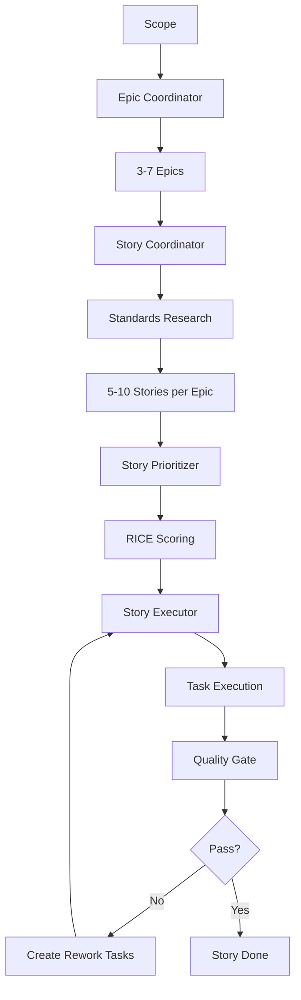

# Linear Task Manager - 任务管理系统

> 完整的敏捷开发工作流，从 Epic 分解到 Story 执行的自动化管理

---

## 核心能力

### 任务层级

```
Linear Project (Epic)
  └── Linear Issue [label: user-story] (Story)
      └── Linear Issue [parentId: storyId] (Task)
          └── Subtasks (implementation steps)
```

### 完整工作流

| 阶段 | Skill | 功能 |
|------|-------|------|
| **0. 研究准备** | Standards Researcher | 行业标准与架构模式研究 |
| **1. 文档** | Documents Pipeline | 完整文档系统创建 |
| **2. 规划** | Scope Decomposer | Scope → Epic → Story 自动分解 |
| **3. 执行** | Story Executor | 自动化 Story 执行流程 |
| **4. 质量** | Story Quality Gate | 多阶段质量检查 |
| **5. 审计** | Codebase Auditor | 全面的代码库审计 |

---

## 核心原则

### 原则层级

当冲突时，按以下优先级：

1. **行业标准与 RFC** - OAuth 2.0、REST API、OpenAPI
2. **安全标准** - OWASP Top 10、NIST 指南
3. **开发原则** - KISS/YAGNI/DRY（在标准边界内）

### 核心原则

| 原则 | 描述 |
|------|------|
| **Standards First** | 遵循行业标准优先 |
| **YAGNI** | 不提前添加功能 |
| **KISS** | 最简单的有效方案 |
| **DRY** | 不重复代码 |
| **Consumer-First** | 从消费者视角设计 API |
| **Foundation-First** | 从基础向上构建（Database → Repository → Service → API） |
| **Task Granularity** | 最优任务大小 3-5 小时（每个 Story 最多 6 个任务） |
| **Value-Based Testing** | 按业务风险优先（2-5 E2E, 3-8 Integration, 5-15 Unit） |
| **No Legacy Code** | 移除向后兼容垫片和弃用模式 |

---

## 主要功能

### 1. Epic 分解

```
ln-200-scope-decomposer
  └── ln-210-epic-coordinator
      ├── Phase 1: 用户确认
      ├── Phase 2: 创建理想计划（3-7 Epics）
      ├── Phase 3: 检查现有
      └── Phase 4: CREATE/REPLAN 模式
```

**输出：**
- 业务目标
- 成功标准
- 分阶段策略
- Linear Projects（Epics）

### 2. Story 创建

```
ln-220-story-coordinator
  ├── Phase 1: 上下文组装
  ├── Phase 2: 标准研究（ln-001）
  ├── Phase 3: 理想规划（5-10 Stories，INVEST 验证）
  └── Phase 4: CREATE/REPLAN
      ├── ln-221-story-creator
      └── ln-222-story-replanner
```

**输出：**
- 8 部分 Story 文档
- 标准研究插入
- INVEST 验证
- Linear Issues（带标签：user-story）

### 3. Story 优先级

```
ln-230-story-prioritizer
  ├── 市场规模研究（每 Story）
  ├── 竞争分析
  ├── RICE 评分（Reach × Impact × Confidence / Effort）
  └── 优先级分配（P0-P3）
```

**输出：**
- `docs/market/[epic-slug]/prioritization.md`
- 竞争指数（Blue 1-2 / Red 4-5）

### 4. Story 执行

```
ln-400-story-executor
  ├── Priority 0: Backlog（新任务验证）
  ├── Priority 1: To Review（代码审查）
  ├── Priority 2: To Rework（修复）
  └── Priority 3: Todo（执行）
```

**自动化：**
- 质量门委托（ln-500）
- 状态管理
- 任务执行编排

### 5. 质量门

```
ln-500-story-quality-gate
  ├── Pass 1:
  │   ├── ln-501: 代码质量检查
  │   ├── ln-502: 回归检查
  │   └── ln-503: 手动 AC 验证
  └── Pass 2:
      └── 自动化测试验证
```

**Fail-Fast:** 任何门失败立即停止，自动创建重构/bug 任务。

---

## 配置

### Linear API 配置

1. 创建 API Key：`https://linear.app/settings/api`
2. 在 `docs/tasks/kanban_board.md` 中配置：

```markdown
# Linear Kanban Board

## Team Configuration
- **Team ID**: `YOUR_TEAM_ID`
- **API Key**: `LIN_API_KEY` (环境变量)
- **Epic Prefix**: `EPIC-`
- **Story Label**: `user-story`
```

### 自动发现

Skills 自动从 `kanban_board.md` 发现配置：
- Team ID
- Epic/Story 编号
- 项目映射

---

## 典型工作流

### 自动化工作流

```bash
# 1. 项目启动
ln-700-project-bootstrap
# → 依赖升级 → 结构迁移 → DevOps 设置 → 质量配置 → Docker

# 2. 文档创建
ln-100-documents-pipeline
# → CLAUDE.md, requirements.md, architecture.md, tech_stack.md, ...

# 3. Epic 分解
ln-210-epic-coordinator
# → 3-7 Linear Projects (Epics)

# 4. Story 创建
ln-220-story-coordinator
# → 5-10 Stories per Epic (with Standards Research)

# 5. 自动执行
ln-400-story-executor
# → Todo → In Progress → To Review → Done (完全自动化)
```

### 手动分步工作流

```bash
# 1. 创建 Story
ln-221-story-creator

# 2. 分解为任务
ln-300-task-coordinator
# → 1-6 implementation tasks

# 3. 验证 Story
ln-310-story-validator

# 4. 执行任务
ln-401-task-executor

# 5. 审查
ln-402-task-reviewer

# 6. 质量门
ln-500-story-quality-gate
```

---

## 文档模板

### Story 模板（8 部分）

```markdown
# [Story Title]

## User Story
As a [user type], I want [action] so that [benefit].

## Acceptance Criteria
- [ ] AC 1
- [ ] AC 2
- [ ] AC 3

## Technical Notes
### Standards Research
[inserted by ln-001]

### Implementation Notes
### Dependencies
### Risk Assessment

## Tasks
1. [Task 1](link)
2. [Task 2](link)

## Testing Strategy
### E2E Tests (2-5)
### Integration Tests (3-8)
### Unit Tests (5-15)

## Definition of Done
- [ ] All tasks completed
- [ ] AC verified
- [ ] Code reviewed
- [ ] Tests passing
- [ ] Documentation updated

## References
- [Standard 1](link)
- [Related Epic](link)
```

---

## 参考文档

详细参考文档位于 `references/` 目录：

| 文件 | 描述 |
|------|------|
| `task-hierarchy.md` | Epic/Story/Task 层级详解 |
| `story-validation.md` | 2025 标准验证规则 |
| `quality-gates.md` | 多阶段质量检查流程 |
| `testing-strategy.md` | 基于风险的测试方法 |
| `linear-api.md` | Linear API 集成指南 |

---

## 质量标准

### Story 标准（2025）

1. **CRITICAL PATH FIRST** - 关键路径优先
2. **INVEST 验证** - Independent, Negotiable, Valuable, Estimable, Small, Testable
3. **标准研究** - 每个包含行业标准的 Story
4. **技术笔记** - 完整的实现指南
5. **测试策略** - E2E 优先的测试金字塔

### 任务标准

1. **大小** - 3-5 小时最优
2. **数量** - 每个 Story 最多 6 个任务
3. **类型** - implementation, refactoring, test
4. **DRY 检查** - 自动检测相似功能（≥70%）

---

## 工作流图



---

## 集成状态

| 集成 | 状态 | 描述 |
|------|------|------|
| Linear API | ✅ | 完整的 CRUD 操作 |
| MCP Context7 | ✅ | 标准研究 |
| MCP Ref | ✅ | 最佳实践研究 |
| WebSearch | ✅ | 市场研究 |

---

## 资源

- **Linear API 文档**: https://developers.linear.app
- **敏捷开发指南**: https://www.agilealliance.org
- **INVEST 标准**: https://billwake.net/2013/07/16/invest-mnemonics

---

## 设计哲学

本 skill 系统遵循：

- **Orchestrator-Worker Pattern** - 清晰的职责分离
- **Progressive Disclosure** - 主技能概述，参考文件详细
- **Token Efficiency** - 元数据加载（~50 tokens/Story），按需加载完整描述
- **Idempotency** - 安全重复执行
- **Fail-Fast** - 尽早失败原则

---

**版本:** 1.0.0
**许可:** MIT
**作者:** MindSymphony 团队（基于 levnikolaevich/claude-code-skills）
