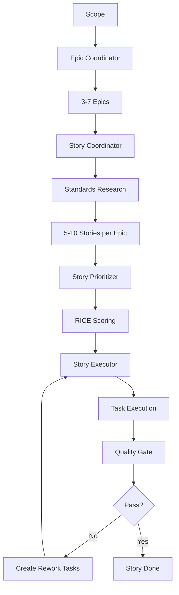

# Linear Task Manager - 任务管理集成

> 完整的敏捷开发工作流，从 Epic 分解到 Story 执行的自动化管理

---

## 核心能力

### 任务层级

```
Linear Project (Epic)
  └── Linear Issue [label: user-story] (Story)
      └── Linear Issue [parentId: storyId] (Task)
          └── Subtasks (implementation steps)
```

### 完整工作流自动化

| 阶段 | 功能 | 描述 |
|------|------|------|
| **0. 研究准备** | Standards Researcher | 行业标准与架构模式研究 |
| **1. 文档** | Documents Pipeline | 完整文档系统创建 |
| **2. 规划** | Scope Decomposer | Scope → Epic → Story 自动分解 |
| **3. 执行** | Story Executor | 自动化 Story 执行流程 |
| **4. 质量** | Story Quality Gate | 多阶段质量检查 |
| **5. 审计** | Codebase Auditor | 全面的代码库审计 |

---

## 触发词

### 中文
- Linear、任务管理
- Epic、Story
- 敏捷开发、任务分解

### English
- Linear, task management
- Epic, Story
- agile, task breakdown

---

## 命令前缀

```
/linear [action]
/epic [operation]
/story [operation]
```

---

## 使用示例

### 示例1：Epic 分解

```
用户：帮我分解这个用户认证 Epic

激活：linear-task-manager
响应：
1. 分析 Epic 范围
2. 创建 3-7 个 Linear Projects（子 Epics）
3. 定义业务目标和成功标准
4. 分阶段策略
5. 更新 kanban_board.md
```

### 示例2：Story 创建

```
用户：为这个 Epic 创建 Stories

激活：linear-task-manager
响应：
1. 上下文组装（Epic 提取、前端研究）
2. 标准研究（行业标准和 RFC）
3. 创建 5-10 个 Stories
4. INVEST 验证
5. 生成 Linear Issues（带 user-story 标签）
```

### 示例3：Story 验证

```
用户：验证这个 Story 是否符合 2025 标准

激活：linear-task-manager
响应：
1. CRITICAL PATH FIRST 分析
2. 17 条标准验证
3. TRIVIAL CRUD 检测
4. 生成修复建议
5. 自动修复（可选）
```

---

## 与其他 Skill 协作

### 与 planning-with-files 配合

```yaml
场景：复杂项目规划
linear-task-manager:
  - Epic/Story/Task 层级管理
  - Linear API 集成
planning-with-files:
  - task_plan.md 记录阶段
  - findings.md 存储研究
  - progress.md 追踪执行
结果：Linear + 文件系统双重记忆
```

### 与 code-refactoring-expert 配合

```yaml
场景：技术债务管理
linear-task-manager:
  - 在 Epic 0 创建重构任务
  - 追踪技术债务修复
code-refactoring-expert:
  - 重构策略
  - 代码质量改进
结果：系统化的技术债务管理
```

---

## 核心原则

### 原则层级

当冲突时，按以下优先级：

1. **行业标准与 RFC** - OAuth 2.0、REST API、OpenAPI
2. **安全标准** - OWASP Top 10、NIST 指南
3. **开发原则** - KISS/YAGNI/DRY（在标准边界内）

### 核心原则

| 原则 | 描述 |
|------|------|
| **Standards First** | 遵循行业标准优先 |
| **YAGNI** | 不提前添加功能 |
| **KISS** | 最简单的有效方案 |
| **DRY** | 不重复代码 |
| **Consumer-First** | 从消费者视角设计 API |
| **Foundation-First** | 从基础向上构建 |
| **Task Granularity** | 最优任务大小 3-5 小时 |
| **Value-Based Testing** | 按业务风险优先测试 |
| **No Legacy Code** | 移除向后兼容垫片 |

---

## 典型工作流

### 自动化工作流（推荐）

```bash
# 完全自动化的开发流程
ln-400-story-executor
# → Todo → In Progress → To Review → Done
# → 自动质量门
# → 自动创建重构/bug 任务
```

### 手动分步工作流

```bash
# 1. Epic 分解
ln-210-epic-coordinator

# 2. Story 创建
ln-220-story-coordinator

# 3. Story 优先级
ln-230-story-prioritizer

# 4. 任务分解
ln-300-task-coordinator

# 5. Story 验证
ln-310-story-validator

# 6. 执行
ln-401-task-executor

# 7. 审查
ln-402-task-reviewer

# 8. 质量门
ln-500-story-quality-gate
```

---

## Linear API 配置

### 设置 API Key

1. 访问 `https://linear.app/settings/api`
2. 创建 API Key
3. 设置环境变量 `LIN_API_KEY`

### 配置文件

在 `docs/tasks/kanban_board.md` 中配置：

```markdown
# Linear Kanban Board

## Team Configuration
- **Team ID**: `YOUR_TEAM_ID`
- **API Key**: `LIN_API_KEY` (环境变量)
- **Epic Prefix**: `EPIC-`
- **Story Label**: `user-story`

## Current Projects
| Epic | ID | Status |
|------|-----|--------|
| Authentication | EPIC-1 | In Progress |
| User Profile | EPIC-2 | Backlog |
```

### 自动发现

Skills 自动从 `kanban_board.md` 发现：
- Team ID
- Epic/Story 编号
- 项目映射

---

## 质量标准

### Story 标准（2025）

1. **CRITICAL PATH FIRST** - 关键路径优先
2. **INVEST 验证** - Independent, Negotiable, Valuable, Estimable, Small, Testable
3. **标准研究** - 每个包含行业标准的 Story
4. **技术笔记** - 完整的实现指南
5. **测试策略** - E2E 优先的测试金字塔

### 任务标准

| 标准 | 要求 |
|------|------|
| **大小** | 3-5 小时最优 |
| **数量** | 每个 Story 最多 6 个任务 |
| **类型** | implementation, refactoring, test |
| **DRY 检查** | 自动检测相似功能（≥70%） |

---

## 工作流图



---

## 参考文档

完整参考文档位于 `/skills/skills/linear-task-manager/references/`：

| 文件 | 描述 |
|------|------|
| `task-hierarchy.md` | Epic/Story/Task 层级详解 |
| `story-validation.md` | 2025 标准验证规则 |
| `quality-gates.md` | 多阶段质量检查流程 |
| `testing-strategy.md` | 基于风险的测试方法 |
| `linear-api.md` | Linear API 集成指南 |

---

## 资源

- **Linear API 文档**: https://developers.linear.app
- **敏捷开发指南**: https://www.agilealliance.org
- **INVEST 标准**: https://billwake.net/2013/07/16/invest-mnemonics

---

## 详细文档

完整文档位置：`/skills/skills/linear-task-manager/SKILL.md`

**基于**: levnikolaevich/claude-code-skills (84 生产级 skills)
