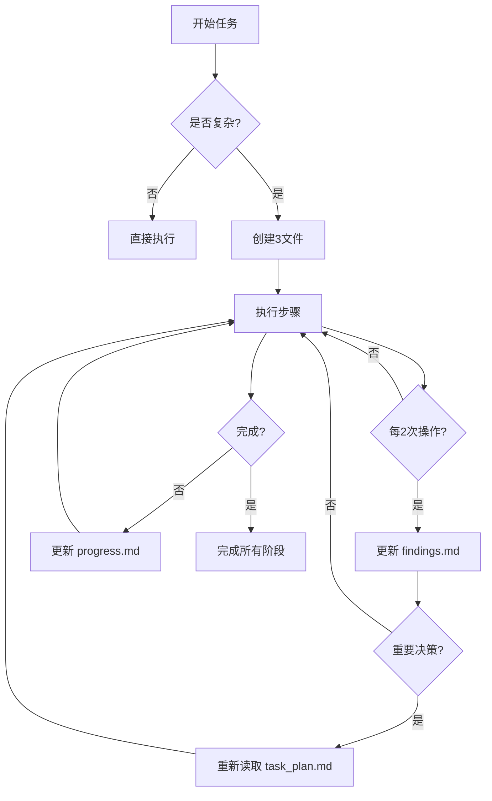

# Planning with Files - 工作流记忆系统

> **像 Manus 一样工作** — 使用文件系统作为 AI 的持久化记忆

---

## 核心理念

```
Context Window = RAM  (易失、有限)
Filesystem       = Disk (持久、无限)

→ 任何重要信息都写入磁盘
```

### 为什么需要这个技能？

Claude Code (和大多数 AI Agent) 存在的问题：

| 问题 | 描述 | 解决方案 |
|------|------|----------|
| **易失记忆** | TodoWrite 工具在上下文重置后消失 | 文件系统持久化 |
| **目标漂移** | 50+ 工具调用后，原始目标被遗忘 | task_plan.md 持续追踪 |
| **隐藏错误** | 失败未被跟踪，同样错误重复出现 | progress.md 记录所有尝试 |
| **上下文塞满** | 所有信息塞入上下文而非存储 | findings.md 存储研究发现 |

---

## 3文件模式

对于每个复杂任务，创建三个文件：

```
task_plan.md      → 阶段和进度追踪
findings.md       → 研究和发现存储
progress.md       → 会话日志和测试结果
```

### 文件职责

#### task_plan.md - 任务计划

```markdown
# 任务名称

## 目标
[简洁的目标描述]

## 阶段
- [ ] Phase 1: [名称]
  - [ ] 步骤 1.1
  - [ ] 步骤 1.2
- [ ] Phase 2: [名称]
  - [ ] 步骤 2.1
- [ ] Phase 3: [名称]

## 尝试记录
| 尝试 | 方法 | 结果 | 下一步 |
|------|------|------|--------|
| 1 | 方法A | 失败: 原因 | 方法B |
| 2 | 方法B | 成功 | 完成阶段 |

## 阻塞问题
- [ ] 问题1: 描述
- [ ] 问题2: 描述
```

#### findings.md - 研究发现

```markdown
# 研究发现

## 架构洞察
[文件系统/代码结构的重要发现]

## 关键文件
- `path/to/file` - 描述和重要性

## 技术栈
[检测到的技术栈和工具]

## 参考资料
- [链接/文档] - 描述
```

#### progress.md - 进度日志

```markdown
# 会话进度

## 操作历史
| 时间 | 操作 | 文件 | 状态 |
|------|------|------|------|
| ... | Read | file.py | ✅ |
| ... | Edit | file.py | ✅ |

## 测试结果
[测试执行记录]

## 下一步
[当前会话的下一步]
```

---

## 使用规则

### 核心规则 (四大原则)

1. **先创建计划** — 从 task_plan.md 开始，绝不盲目开始
2. **2动作规则** — 每2次查看/浏览器操作后保存发现
3. **记录所有错误** — 它们帮助避免重复失败
4. **永不重复失败** — 追踪尝试，变更方法

### 何时使用此模式

✅ **使用此模式：**
- 多步骤任务 (3+ 步骤)
- 研究任务
- 构建/创建项目
- 跨越多工具调用的任务

❌ **跳过此模式：**
- 简单问题
- 单文件编辑
- 快速查询

---

## 工作流程

### 启动阶段

1. **识别复杂任务** — 任务需要3+步骤
2. **创建 task_plan.md** — 定义阶段和目标
3. **初始化 findings.md** — 空文件，准备存储发现
4. **初始化 progress.md** — 开始会话日志

### 执行阶段



### 维护阶段

1. **重要决策前** — 重新读取 task_plan.md
2. **每2次查看操作** — 保存到 findings.md
3. **错误/失败** — 记录到 task_plan.md 的尝试记录表
4. **会话结束** — 更新 progress.md 的下一步

---

## 与 MindSymphony 集成

### 作为 MindSymphony 扩展

当在 MindSymphony 上下文中激活时，本技能提供：

1. **任务分解支持** — 与 cognitive-architect 配合
2. **研究记忆** — 与 knowledge-explorer 配合
3. **代码审查记录** — 与 code-refactoring-expert 配合

### 触发方式

```yaml
# MindSymphony 意图路由
/planning [任务] → 激活本技能
/plan [任务]    → 快捷触发
```

---

## 模板

### task_plan.md 模板

```markdown
# {{TASK_NAME}}

## 目标
{{OBJECTIVE}}

## 阶段
- [ ] Phase 1: 准备
  - [ ] 理解需求
  - [ ] 检查现有文件
- [ ] Phase 2: 执行
  - [ ] 核心实现
  - [ ] 测试验证
- [ ] Phase 3: 完成
  - [ ] 清理
  - [ ] 文档

## 尝试记录
| 尝试 | 方法 | 结果 | 下一步 |
|------|------|------|--------|

## 阻塞问题
- [ ] 无

---
创建时间: {{TIMESTAMP}}
最后更新: {{LAST_UPDATE}}
```

### findings.md 模板

```markdown
# 研究发现

## 架构洞察

## 关键文件

## 技术栈

## 参考资料

---
创建时间: {{TIMESTAMP}}
```

### progress.md 模板

```markdown
# 会话进度

## 操作历史

## 测试结果

## 下一步

---
会话开始: {{TIMESTAMP}}
```

---

## 示例用法

### 示例1：代码重构任务

```
用户: 帮我重构这个大型项目的认证系统

Planning with Files 激活:
1. 创建 task_plan.md
2. 扫描代码结构 → findings.md
3. 分解重构阶段
4. 执行重构 → progress.md
5. 记录每次尝试的结果
```

### 示例2：研究任务

```
用户: 研究如何优化我们的数据库查询性能

Planning with Files 激活:
1. 创建 task_plan.md
2. 分析现有查询 → findings.md
3. 研究优化方案
4. 测试改进 → progress.md
5. 记录性能提升
```

---

## 最佳实践

### DO ✅

- 在任务开始前创建计划
- 定期重新读取计划文件
- 记录所有尝试和结果
- 使用复选框追踪进度
- 保持文件简洁易读

### DON'T ❌

- 不要盲目开始复杂任务
- 不要让发现堆积在上下文中
- 不要忽略失败记录
- 不要更新计划而不保存

---

## 技术细节

### 文件位置

```yaml
# 相对于项目根目录
.planning/
  ├── task_plan.md
  ├── findings.md
  └── progress.md
```

### MindSymphony 集成点

```yaml
# 在 MindSymphony 的集成层注册
integrations:
  planning-with-files:
    type: workflow-memory
    priority: high
    triggers:
      - "复杂任务"
      - "多步骤项目"
      - "研究分析"
```

---

## 来源与致谢

本技能基于：

1. **Manus AI** — 上下文工程模式的开创者
2. **planning-with-files** — OthmanAdi 的 Claude Code 技能
3. **Context Engineering** — AI Agent 的记忆管理原则

### 相关资源

- [Manus AI 架构分析](https://github.com/OthmanAdi/planning-with-files)
- [Claude Code Memory 文档](https://code.claude.com/docs/en/memory)

---

**版本:** 1.0.0
**许可:** MIT
**作者:** MindSymphony 团队 (基于 OthmanAdi/planning-with-files)
